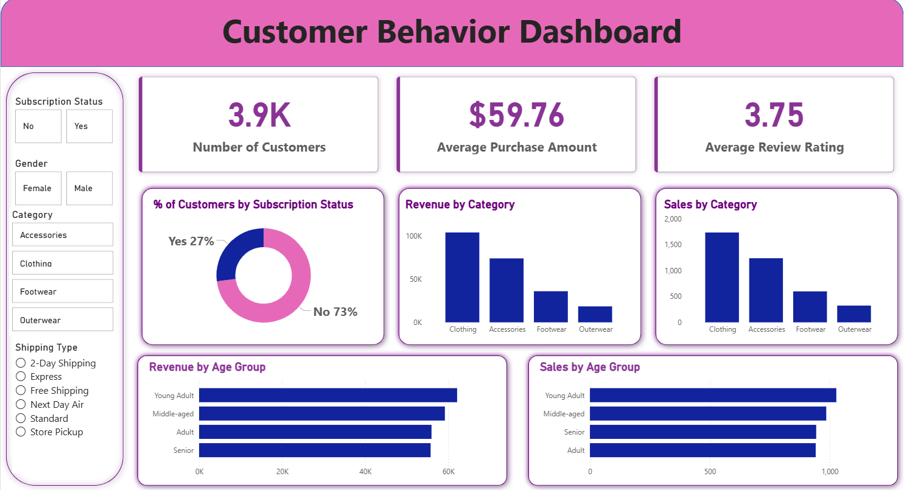

# 🛒 Customer Shopping Behavior Analysis

An end-to-end data analysis project that uncovers actionable business insights from retail transactional data using **Python**, **PostgreSQL**, and **Power BI**.

---

## 📊 Project Overview
This project analyzes a dataset containing **3,900 customer transactions** to understand shopping behavior, optimize customer segmentation, and identify key drivers of subscription and revenue growth.

## 🛠️ Tech Stack & Tools
* **Python (Pandas):** Data Cleaning, Missing Value Imputation, Feature Engineering.
* **PostgreSQL:** Data Storage and Advanced SQL Querying (CTEs, Window Functions).
* **Power BI:** Interactive Dashboard & Data Visualization.

---

## 🚀 Project Workflow

### 1. Data Cleaning & Feature Engineering (Python)
* Handled missing values in customer reviews using the median rating of each category.
* Dropped redundant columns (`promo_code_used` was identical to `discount_applied`).
* Engineered new features: `age_group` and `purchase_frequency_days`.

### 2. Business Intelligence Queries (SQL)
* Segmented customers into (New, Returning, Loyal) based on purchase frequency.
* Analyzed subscription rates and correlated them with the average spend.
* Compared revenue contribution by gender and age group.

### 3. Interactive Dashboard (Power BI)
* Built a dynamic dashboard to track KPIs (Total Revenue, Avg Purchase Amount, Subscription Rate).
* Visualized top performing categories and discount impact.

---

## 📈 Key Visuals
 

## 💡 Key Business Recommendations
1. **Target the 73% non-subscribers** with a specialized retention program.
2. **Optimize discount policy** for high-discount-dependent products (Hats & Sneakers).
3. **Build targeted reward loops** to convert "Returning" customers into "Loyal" ones.
